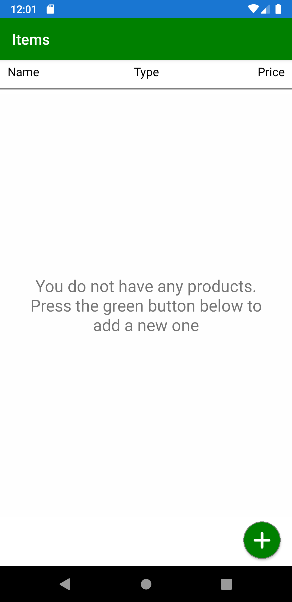
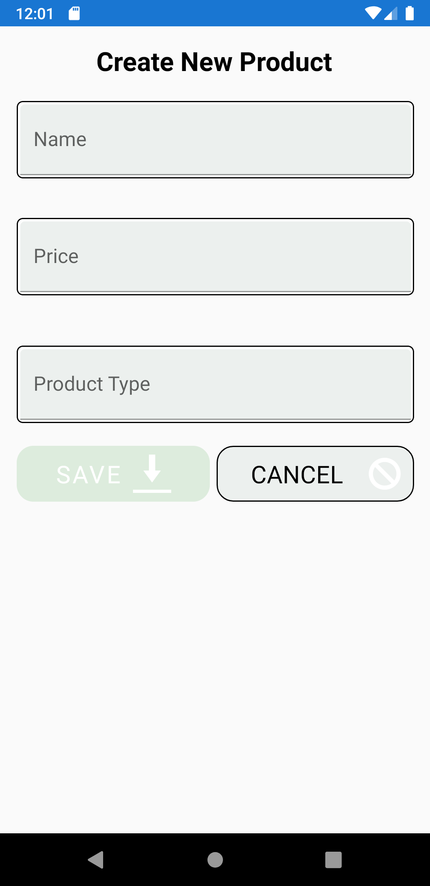
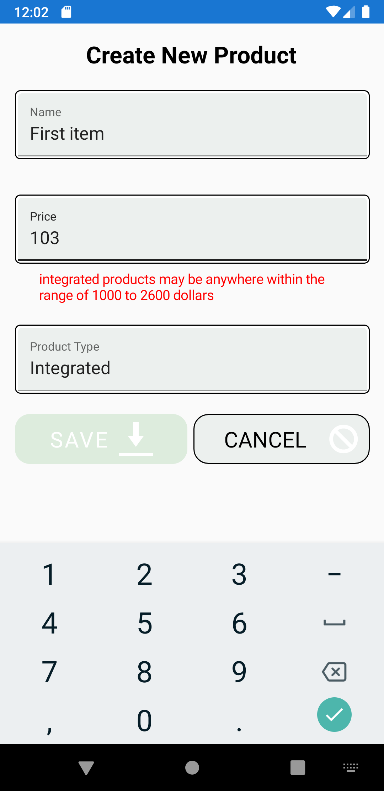
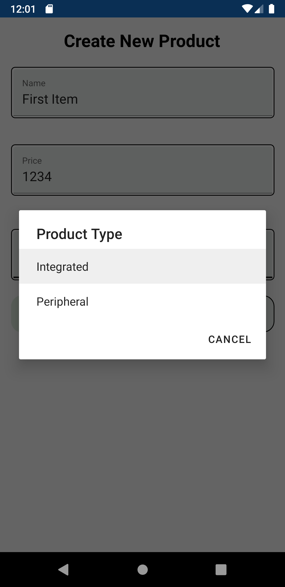
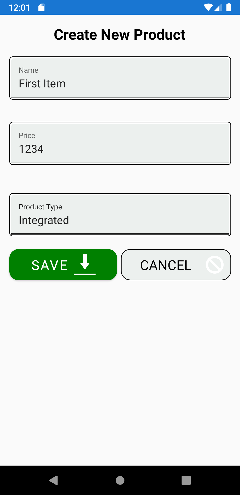
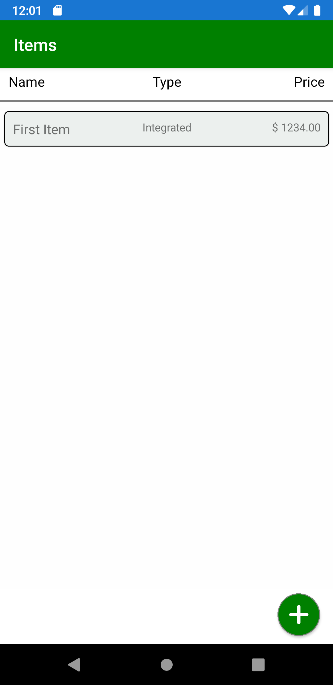
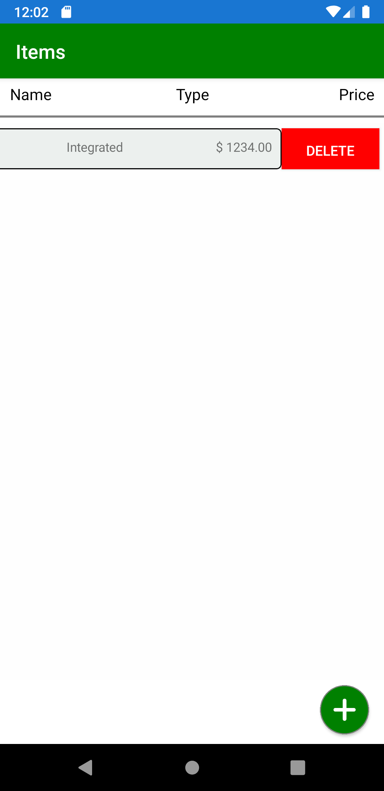
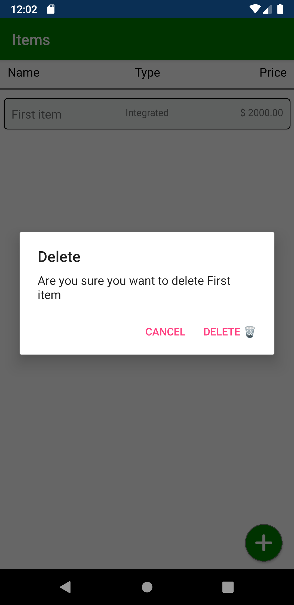

# Employment-Technical-Task

Your task is to create a new Expo Project for a product storage where you can add/edit and delete products to the store .

## Project description

The project is a system that represent a store with products. Using the system the user can add new products and edit/delete existing products.

There are two types of products:

1.  Peripheral
2.  Integrated

**Peripheral** products can have any price larger than $0 (zero).

**Integrated** products can have any price between $1000 and $2600

You cannot add a product if there is another product with the same name.

## Technical Requirements

- The App should be build with React Native Expo
- Please use Typescript only and avoid using "any" is possible.
- For state management please use hooks and context.
- Notice that for deleting the product you need to swipe to left first.
- The app should provide offline storage. Which means that if the app is restarted the products added already should be still in the storage
- Create a new branch and when you push the code to it create a Pull Request before merging to master.

## Bonus Requirement

- Make few tests using jest.

## What is next

After you are done with your code please push your code to master by making a PullRequest from another branch and tell us so we merge it .

Below you can find some screenshots that would help you to understand the task, try to make it as close to the ui as possible.

We will be asking you about your code, trying to understand how do you think.

You do not need to copy the UI design but it is better to keep it as close as possible to it. However, if you made a noticeable change you will be asked about the reason behind it.

## Screenshots

